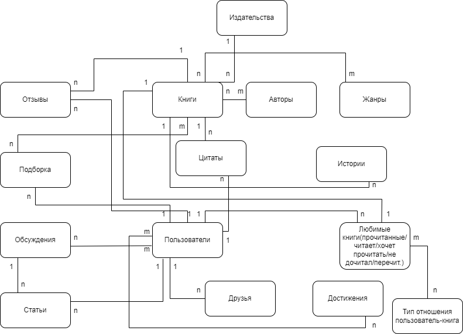

# DB_labs. LiveLib
*(сайт о книгах, социальная сеть читателей книг)*

Рассмотрим следующий функционал сайта:
-	получение информации о книгах;
-	обмен мнениями между пользователями.

Основные сущности, необходимые для представления данной базы данных: (см. схему).

Таблицы (+ для каждой id, created, updated, deleted):
1.	**source** (картинки, файлы и т.д. в файловой системе): путь в файловой системе
2.	**Издательства**: publisher_id, описание
3.	**Книги**: book_id, название, описание, дата выхода, publisher_id, серия (можно вынести отдельной табличкой), обложка
4.	**Авторы**: author_id, имя, фамилия, фото, описание, годы жизни (рождение, смерть(null))
5.	**Книга – Автор**: book_id, author_id
6.	**Жанры**: genre_id, название, описание (основные черты, кому могут понравится)
7.	**Книга – Жанр**: book_id, genre_id
8.	**Цитаты**: quotes_id, book_id, user_id, текст
9.	**Истории** (истории из жизни, связанные с книгой): story_id, book_id, user_id, текст
10.	**Отзывы**: review_id, book_id, user_id, текст, рейтинг
11.	**Подборки**: user_id, user_id (автор), название, описание
12.	**Книга – Подборка**: book_id, list_id
13.	**Пользователи**: user_id, имя, фамилия, nick, описание, фото, пароль
14.	**Друзья (пользователь – пользователь)**: id, user_id_1, user_id_2
15.	**Достижения**: reword_id, описание (за что дается)
16.	**Достижение – пользователь**: id_user, id_reword
17.	**Оценки**: mark_id, чему оценка (отзыв, цитата, история), какая оценка
18.	**Обсуждения**: dialog_id, user_id (автор), название, описание
19.	**Статьи**: article_id, user_id (автор), dialog_id (обсуждение), текст
20.	**Тип отношения пользователь-книга**: user_book_type_id, название
21.	**Пользователь – Книга**: id, user_book_type_id, book_id, user_id
